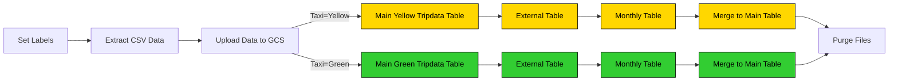

## 2.4 ELT Pipelines in Kestra: Google Cloud Platform

Now that you've learned how to build ETL pipelines locally using Postgres, we are ready to move to the cloud. In this section, we'll load the same Yellow and Green Taxi data to Google Cloud Platform (GCP) using: 
1. Google Cloud Storage (GCS) as a data lake  
2. BigQuery as a data warehouse.

### 2.4.1 - ETL vs ELT

In 2.3, we made a ETL pipeline inside of Kestra:
- **Extract:** Firstly, we extract the dataset from GitHub
- **Transform:** Next, we transform it with Python
- **Load:** Finally, we load it into our Postgres database

While this is very standard across the industry, sometimes it makes sense to change the order when working with the cloud. If you're working with a large dataset, like the Yellow Taxi data, there can be benefits to extracting and loading straight into a data warehouse, and then performing transformations directly in the data warehouse. When working with BigQuery, we will use ELT:
- **Extract:** Firstly, we extract the dataset from GitHub
- **Load:** Next, we load this dataset (in this case, a csv file) into a data lake (Google Cloud Storage)
- **Transform:** Finally, we can create a table inside of our data warehouse (BigQuery) which uses the data from our data lake to perform our transformations.

The reason for loading into the data warehouse before transforming means we can utilize the cloud's performance benefits for transforming large datasets. What might take a lot longer for a local machine, can take a fraction of the time in the cloud.

Over the next few videos, we'll look at setting up BigQuery and transforming the Yellow Taxi dataset.

#### Videos

- **2.4.1 - ETL vs ELT**  
  

#### Resources
- [ETL vs ELT Video](https://go.kestra.io/de-zoomcamp/etl-vs-elt)
- [Data Warehouse 101 Video](https://go.kestra.io/de-zoomcamp/data-warehouse-101)
- [Data Lakes 101 Video](https://go.kestra.io/de-zoomcamp/data-lakes-101)

### 2.4.2 Setup Google Cloud Platform (GCP)

Before we start loading data to GCP, we need to set up the Google Cloud Platform. 

First, adjust the following flow [`06_gcp_kv.yaml`](flows/06_gcp_kv.yaml) to include your service account, GCP project ID, BigQuery dataset and GCS bucket name (_along with their location_) as KV Store values:
- GCP_PROJECT_ID
- GCP_LOCATION
- GCP_BUCKET_NAME
- GCP_DATASET.

#### Create GCP Resources

If you haven't already created the GCS bucket and BigQuery dataset in the first week of the course, you can use this flow to create them: [`07_gcp_setup.yaml`](flows/07_gcp_setup.yaml).

> [!WARNING]  
> The `GCP_CREDS` service account contains sensitive information. Ensure you keep it secure and do not commit it to Git. Keep it as secure as your passwords.

#### Videos

- **2.4.2 - Setup Google Cloud Platform**  
  

#### Resources
- [Set up Google Cloud Service Account in Kestra](https://go.kestra.io/de-zoomcamp/google-sa)

### 2.4.3 GCP Workflow: Load Taxi Data to BigQuery

Now that Google Cloud is set up with a storage bucket, we can start the ELT process.

The flow code: [`08_gcp_taxi.yaml`](flows/08_gcp_taxi.yaml).

#### Videos

- **2.4.3 - Create an ETL Pipeline with GCS and BigQuery in Kestra**  
  

### 2.4.4 GCP Workflow: Schedule and Backfill Full Dataset

We can now schedule the same pipeline shown above to run daily at 9 AM UTC for the green dataset and at 10 AM UTC for the yellow dataset. You can backfill historical data directly from the Kestra UI.

Since we now process data in a cloud environment with infinitely scalable storage and compute, we can backfill the entire dataset for both the yellow and green taxi data without the risk of running out of resources on our local machine.

The flow code: [`09_gcp_taxi_scheduled.yaml`](flows/09_gcp_taxi_scheduled.yaml).

#### Videos

- **2.4.4 - GCP Workflow: Schedule and Backfills**  
  

---
