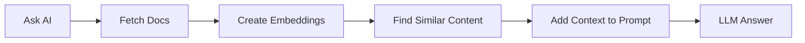

## 2.5 Using AI for Data Engineering in Kestra

This section builds on what you learned earlier in Module 2 to show you how AI can speed up workflow development.

By the end of this section, you will:
- Understand why context engineering matters when collaborating with LLMs
- Use AI Copilot to build Kestra flows faster
- Use Retrieval Augmented Generation (RAG) in data pipelines

### Prerequisites

- Completion of earlier sections in Module 2 (Workflow Orchestration with Kestra)
- Kestra running locally
- Google Cloud account with access to Gemini API (there's a generous free tier!)

---

### 2.5.1 Introduction: Why AI for Workflows?

As data engineers, we spend significant time writing boilerplate code, searching documentation, and structuring data pipelines. AI tools can help us:

- **Generate workflows faster**: Describe what you want to accomplish in natural language instead of writing YAML from scratch
- **Avoid errors**: Get syntax-correct, up-to-date workflow code that follows best practices

However, AI is only as good as the context we provide. This section teaches you how to engineer that context for reliable, production-ready data workflows.

#### Videos

- **2.5.1 - Using AI for Data Engineering**  
  [](https://youtu.be/GHPtRDAv044)

---

### 2.5.2 Context Engineering with ChatGPT

Let's start by seeing what happens when AI lacks proper context.

#### Experiment: ChatGPT Without Context

1. **Open ChatGPT in a private browser window** (to avoid any existing chat context): https://chatgpt.com

2. **Enter this prompt:**
   ```
   Create a Kestra flow that loads NYC taxi data from a CSV file to BigQuery. The flow should extract data, upload to GCS, and load to BigQuery.
   ```

3. **Observe the results:**
   - ChatGPT will generate a Kestra flow, but it likely contains:
     - **Outdated plugin syntax** e.g., old task types that have been renamed
     - **Incorrect property names** e.g., properties that don't exist in current versions
     - **Hallucinated features** e.g., tasks, triggers or properties that never existed

#### Why Does This Happen?

Large Language Models (LLMs) like GPT models from OpenAI are trained on data up to a specific point in time (knowledge cutoff). They don't automatically know about:
- Software updates and new releases
- Renamed plugins or changed APIs

This is the fundamental challenge of using AI: **the model can only work with information it has access to.**

#### Key Learning: Context is Everything

Without proper context:
- ❌ Generic AI assistants hallucinate outdated or incorrect code
- ❌ You can't trust the output for production use

With proper context:
- ✅ AI generates accurate, current, production-ready code
- ✅ You can iterate faster by letting AI generate boilerplate workflow code

In the next section, we'll see how Kestra's AI Copilot solves this problem.

#### Videos

- **2.5.2 - Context Engineering with ChatGPT**  
  [](https://youtu.be/LmnfjGKwnVU)

---

### 2.5.3 AI Copilot in Kestra

Kestra's AI Copilot is specifically designed to generate and modify Kestra flows with full context about the latest plugins, workflow syntax, and best practices.

#### Setup AI Copilot

Before using AI Copilot, you need to configure Gemini API access in your Kestra instance.

**Step 1: Get Your Gemini API Key**

1. Visit Google AI Studio: https://aistudio.google.com/app/apikey
2. Sign in with your Google account
3. Click "Create API Key"
4. Copy the generated key (keep it secure!)

> [!WARNING]  
> Never commit API keys to Git. Always use environment variables or Kestra's KV Store.

**Step 2: Configure Kestra AI Copilot**

Add the following to your Kestra configuration. You can do this by modifying your `docker-compose.yml` file from 2.2:

```yaml
services:
  kestra:
    environment:
      KESTRA_CONFIGURATION: |
        kestra:
          ai:
            type: gemini
            gemini:
              model-name: gemini-2.5-flash
              api-key: ${GEMINI_API_KEY}
```

Then restart Kestra:
```bash
cd 02-workflow-orchestration/docker
export GEMINI_API_KEY="your-api-key-here"
docker compose up -d
```

#### Exercise: ChatGPT vs AI Copilot Comparison

**Objective:** Learn why context engineering matters.

1. **Open Kestra UI** at http://localhost:8080
2. **Create a new flow** and open the Code editor panel
3. **Click the AI Copilot button** (sparkle icon ✨) in the top-right corner
4. **Enter the same exact prompt** we used with ChatGPT:
   ```
   Create a Kestra flow that loads NYC taxi data from a CSV file to BigQuery. The flow should extract data, upload to GCS, and load to BigQuery.
   ```
5. **Compare the outputs:**
   - ✅ Copilot generates executable, working YAML
   - ✅ Copilot uses correct plugin types and properties
   - ✅ Copilot follows current Kestra best practices

**Key Learning:** Context matters! AI Copilot has access to current Kestra documentation, generating Kestra flows better than a generic ChatGPT assistant.

#### Videos

- **2.5.3 - AI Copilot in Kestra**  
  [](https://youtu.be/3IbjHfC8bMg)


### 2.5.4 Bonus: Retrieval Augmented Generation (RAG)

To further learn how to provide context to your prompts, this bonus section demonstrates how to use RAG.

#### What is RAG?

**RAG (Retrieval Augmented Generation)** is a technique that:
1. **Retrieves** relevant information from your data sources
2. **Augments** the AI prompt with this context
3. **Generates** a response grounded in real data

This solves the hallucination problem by ensuring the AI has access to current, accurate information at query time.

#### How RAG Works in Kestra



**The Process:**
1. **Ingest documents**: Load documentation, release notes, or other data sources
2. **Create embeddings**: Convert text into vector representations using an LLM
3. **Store embeddings**: Save vectors in Kestra's KV Store (or a vector database)
4. **Query with context**: When you ask a question, retrieve relevant embeddings and include them in the prompt
5. **Generate response**: The LLM has real context and provides accurate answers

#### Exercise: Retrieval With vs Without Context

**Objective:** Understand how RAG eliminates hallucinations by grounding LLM responses in real data.

**Part A: Without RAG**
1. Navigate to the [`10_chat_without_rag.yaml`](flows/10_chat_without_rag.yaml) flow in your Kestra UI
2. Click **Execute**
3. Wait for the execution to complete
4. Open the **Logs** tab
5. Read the output - notice how the response about "Kestra 1.1 features" is:
   - Vague or generic
   - Potentially incorrect
   - Missing specific details
   - Based only on the model's training data (which may be outdated)

**Part B: With RAG**
1. Navigate to the [`11_chat_with_rag.yaml`](flows/11_chat_with_rag.yaml) flow
2. Click **Execute**
3. Watch the execution:
   - First task: **Ingests** Kestra 1.1 release documentation, creates **embeddings** and stores them
   - Second task: **Prompts LLM** with context retrieved from stored embeddings
4. Open the **Logs** tab
5. Compare this output with the previous one - notice how it's:
   - ✅ Specific and detailed
   - ✅ Accurate with real features from the release
   - ✅ Grounded in actual documentation

**Key Learning:** RAG (Retrieval Augmented Generation) grounds AI responses in current documentation, eliminating hallucinations and providing accurate, context-aware answers.

#### RAG Best Practices

1. **Keep documents updated**: Regularly re-ingest to ensure current information
2. **Chunk appropriately**: Break large documents into meaningful chunks
3. **Test retrieval quality**: Verify that the right documents are retrieved

#### Additional AI Resources

Kestra Documentation:
- [AI Tools Overview](https://go.kestra.io/de-zoomcamp/ai-tools)
- [AI Copilot](https://go.kestra.io/de-zoomcamp/ai-copilot)
- [RAG Workflows](https://go.kestra.io/de-zoomcamp/rag-workflows)
- [AI Workflows](https://go.kestra.io/de-zoomcamp/ai-workflows)
- [Kestra Blueprints](https://go.kestra.io/de-zoomcamp/blueprints) - Pre-built workflow examples

Kestra Plugin Documentation:
- [AI Plugin](https://go.kestra.io/de-zoomcamp/ai-plugin)
- [RAG Tasks](https://go.kestra.io/de-zoomcamp/ai-rag-task)

External Documentation:
- [Google Gemini](https://go.kestra.io/de-zoomcamp/gemini-docs)
- [Google AI Studio](https://go.kestra.io/de-zoomcamp/ai-studio)

#### Videos

- **2.5.4 (Bonus) - Retrieval Augmented Generation**  
  [](https://youtu.be/XuPDQ1UcNyI)
